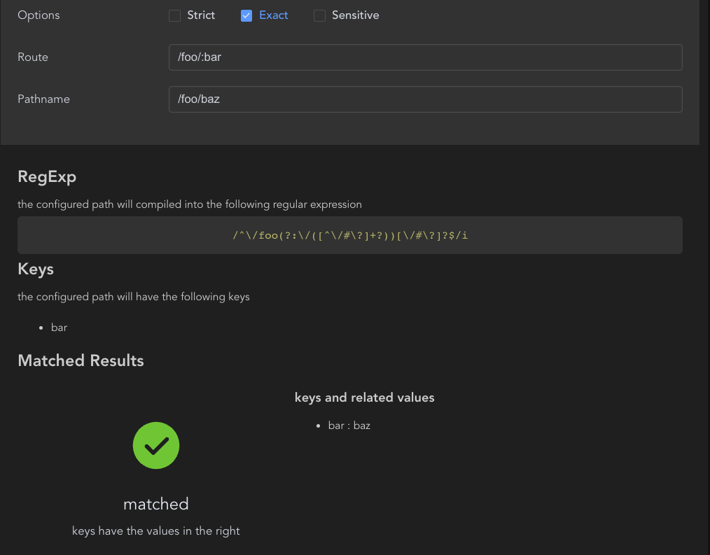

# README

This is a route path tester, to test if a path which you config the `<Route path>` and the pathname of a url is matched.

## Features
The tester can help developers testing the configured path. It has the following features:
- show the matched results of the configured path and the pathname of a url.
- show the regular expression which is compiled by path-to-regexp library.
- if matched, show the matched params.

## Usage
You can type ">path tester" in the command platte to activate this extension. Then, like any website, you can config the route and see the result.

For example, the following image shows how this extension work

**Enjoy!**
